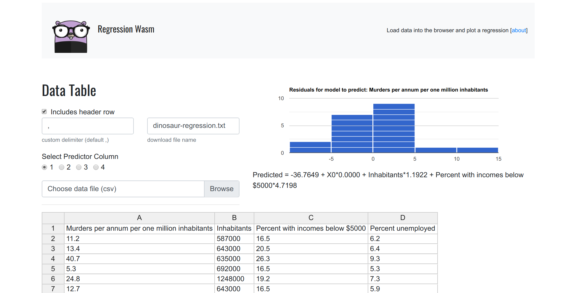
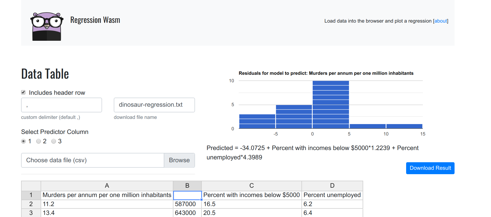
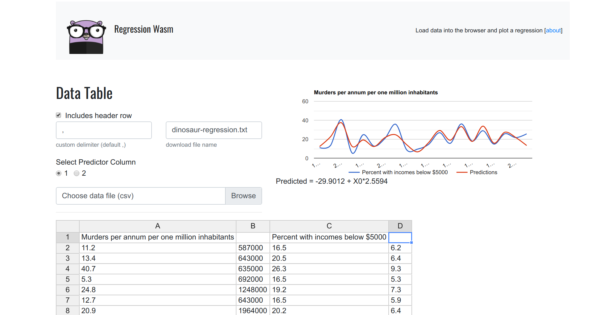
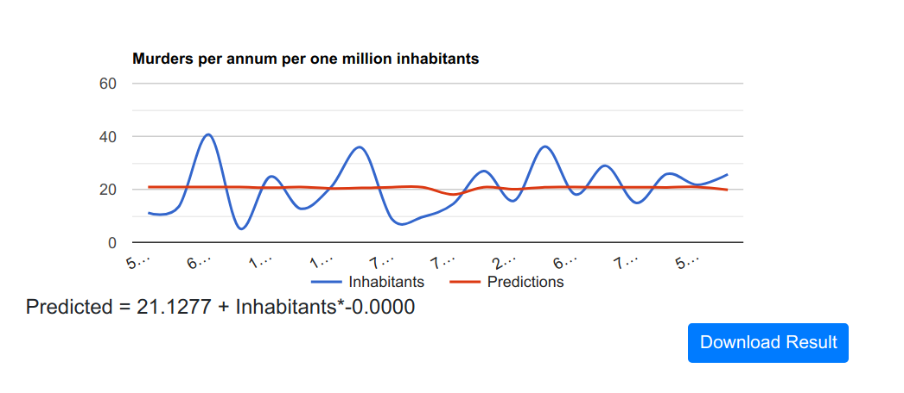
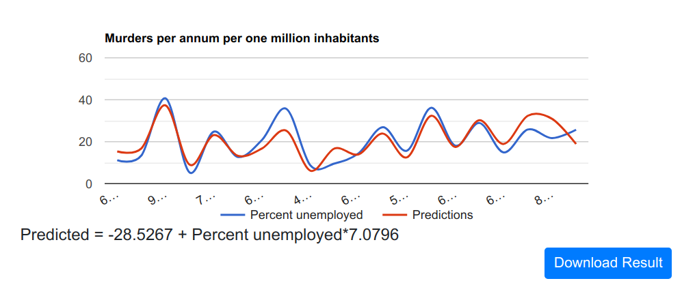
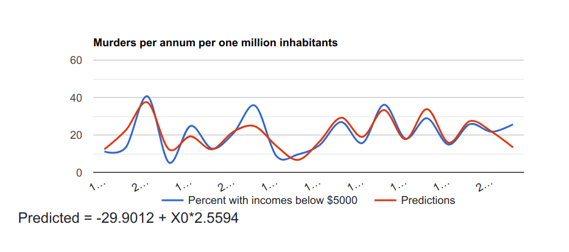

# Regression Wasm

This repository serves a simple [web assembly](https://webassembly.org/) (wasm) application 
to perform a regression, using data from a table in the browser, which can be loaded as a delimited file
by the user. We use a simple [regression library](https://github.com/sajari/regression) to do
the work. See the demo [here](https://vsoch.github.io/regression-wasm/) or continue reading.

## Summary

 - Run a multiple or single regression using Web Assembly
 - Two variables (one predictor, one regression) will generate a line plot showing X vs. Y and predictions
 - More than two variables (one predictor, multiple regressors) performs multiple regression to generate a residual histogram
 - Upload your own data file, change the delimiter, the file name to be saved, or the predictor column

## Overview

When you load the page, you are presented with a loaded data frame. The data is a bit dark,
but it's a nice dataset to show how this works. The first column is the number of murders (per
million habitants) for some city, and each of the remaining columns are variables that might
be used to predict it (inhabitants, percent with incomes below $5000, and percent unemployed).
This is what you see:



### Formula

The formula for our regression model is shown below the plot, in human friendly terms.

```
Predicted = -36.7649 + X0*0.0000 + Inhabitants*1.1922 + Percent with incomes below $5000*4.7198
```

### Residual Plot

Given that we have more than one regressor variable, we need to run a multiple regression,
and so the plot in the upper right is a histogram of the residuals.

 > the residuals are the difference between the actual values (number of murders per million habitants) and the values predicted by our model.

### Filtering

If you remove any single value from a row, it invalidates it, and it won't be included
in the plot. If you remove a column heading, it's akin to removing the entire column.

### Line Plot

But what if we want to plot the relationship between one of the variables X, and our Y?
This is where the tool gets interesting! By removing a column header, we essentially
remove the column from the dataset. Let's first try removing just one, Inhabitants:




We still see a residual plot because it would require more than two dimensions to plot.
Let's remove another one, the percent unemployed:



Now we see a line plot, along with the plotting of the predictions! By simply removing
each column one at a time (and leaving only one Y, and one X) we are actually running
a single regression, and we can do this for each variable:

#### Inhabitants to predict murders



<br>

#### Unemployment to predict murders



<br>

#### Low Income Percentage to predict murders




As we can see, the number of inhabitants (on its own) is fairly useless. The variables
that are strongest here are unemployment and income. 

## Download Data

This of course is a very superficial overview, you would want to download the full model data to get more detail:
The "Download Results" will appear after you generate any kind of plot, and it downloads
a text file with the model output. Here is an example:

```
Dinosaur Regression Wasm
Predicted = -36.7649 + X0*0.0000 + Inhabitants*1.1922 + Percent with incomes below $5000*4.7198
Murders per annum per one million inhabitants|	X0|	Inhabitants|	Percent with incomes below $5000
11.20|	587000.00|	16.50|	6.20
13.40|	643000.00|	20.50|	6.40
40.70|	635000.00|	26.30|	9.30
5.30|	692000.00|	16.50|	5.30
24.80|	1248000.00|	19.20|	7.30
12.70|	643000.00|	16.50|	5.90
20.90|	1964000.00|	20.20|	6.40
35.70|	1531000.00|	21.30|	7.60
8.70|	713000.00|	17.20|	4.90
9.60|	749000.00|	14.30|	6.40
14.50|	7895000.00|	18.10|	6.00
26.90|	762000.00|	23.10|	7.40
15.70|	2793000.00|	19.10|	5.80
36.20|	741000.00|	24.70|	8.60
18.10|	625000.00|	18.60|	6.50
28.90|	854000.00|	24.90|	8.30
14.90|	716000.00|	17.90|	6.70
25.80|	921000.00|	22.40|	8.60
21.70|	595000.00|	20.20|	8.40
25.70|	3353000.00|	16.90|	6.70

N = 20
Variance observed = 92.76010000000001
Variance Predicted = 75.90724706481737
R2 = 0.8183178658153383
```

## About

### Why?

Web assembly can allow us to interact with compiled code directly in the browser,
doing away with any need for a server. While I don't do a large amount of data analysis
for my role proper, I realize that many researchers do, and so with this in mind, 
I wanted to create a starting point for developers to interact with data in the browser.
The minimum conditions for success meant:

 1. being able to load a delimited file into the browser
 2. having the file render as a table
 3. having the data be processed by a compiled wasm
 4. updating a plot based on output from 3.

Thus, the application performs a simple regression based on loading data in the table,
and then plotting the result. To make it fun, I added a cute gopher logo and used an xkcd
plotting library for the result.

### Customization

The basics are here for a developer to create (some GoLang based) functions to
perform data analysis on an input file, and render back to the screen as a plot.
If you need any help, or want to request a custom tool, please don't hesitate to
[open up an issue](https://www.github.com/vsoch/regression-wasm/issues).

## Development

### Local

If you are comfortable with GoLang, and have installed [emscripten](https://emscripten.org), 
you can clone the repository into your $GOPATH under the github folder:

```bash
$ mkdir -p $GOPATH/src.github.com/vsoch
$ cd $GOPATH/src.github.com/vsoch
$ git clone https://www.github.com/vsoch/regression-wasm
```

And then build the wasm.

```bash
$ make
```

And cd into the "docs" folder and start a server to see the result.

```bash
$ cd docs
$ python -m http.server 9999
```

Open the browser to http://localhost:9999


## Docker

If you don't want to install dependencies, just clone the repository, and
build the Docker image:

```bash
$ docker build -t vanessa/regression-wasm .
```

It will install [emscripten](https://emscripten.org/docs/getting_started/FAQ.html),
add the source code to the repository, and compile to wasm. You can then
run the container and expose port 80 to see the compiled interface:

```bash
$ docker run -it --rm -p 80:80 vanessa/regression-wasm
``` 

Then you can proceed to use the interface.
